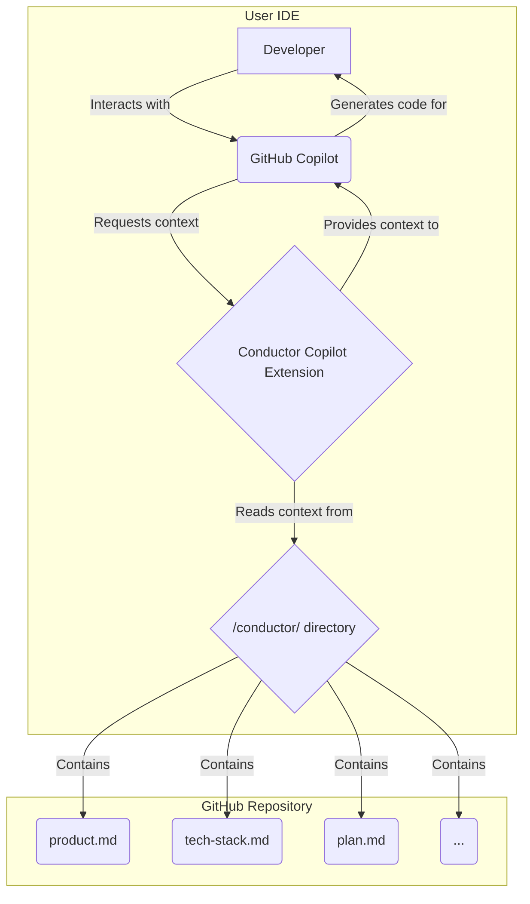

# High-Level Integration Architecture

This document outlines the proposed high-level architecture for integrating Conductor with GitHub Copilot.

## 1. Architectural Diagram

The following diagram illustrates the proposed architecture:

## 2. Data Flow

1.  **User Action:** The developer, working in their IDE, triggers a code suggestion from GitHub Copilot.
2.  **Context Request:** GitHub Copilot, via the Conductor Copilot Extension, requests additional context for the code generation.
3.  **Context Retrieval:** The Conductor Copilot Extension reads the relevant files from the `.conductor/` directory in the user's workspace. This includes:
    *   `product.md`: For high-level product goals.
    *   `tech-stack.md`: For technology constraints and preferences.
    *   `plan.md`: For the current task and its requirements.
    *   `spec.md`: For the overall track specification.
4.  **Context Provision:** The extension formats the retrieved context and provides it to the Copilot model.
5.  **Code Generation:** Copilot uses the provided context to generate more accurate and relevant code suggestions.
6.  **Code Insertion:** The generated code is inserted into the developer's editor.

## 3. Components

*   **Conductor Copilot Extension:** A plugin for GitHub Copilot that implements the Model Context Protocol (MCP). It is responsible for reading the Conductor context files and providing them to the Copilot model.
*   **Conductor CLI:** The existing Conductor CLI will continue to be responsible for setting up the project, creating new tracks, and managing the `conductor/` directory. The extension will be a consumer of the artifacts generated by the CLI.
