# Mermaid Diagram Style Guide

This document outlines standards for creating diagrams using Mermaid syntax in documentation and specifications.

## When to Use Mermaid

Use Mermaid diagrams for:

- **Architecture diagrams**: System components and their relationships
- **Flowcharts**: Process flows, decision trees, workflows
- **Sequence diagrams**: Interactions between components over time
- **Class diagrams**: Object-oriented design and inheritance
- **ER diagrams**: Database schema and relationships
- **Gantt charts**: Project timelines and dependencies
- **State diagrams**: State machines and transitions

Use dedicated tools for:

- Complex visual designs requiring pixel-perfect control
- Diagrams needing custom icons or branding
- Presentations requiring specific styling

## Diagram Types

### Flowcharts

Use for process visualization and decision trees.

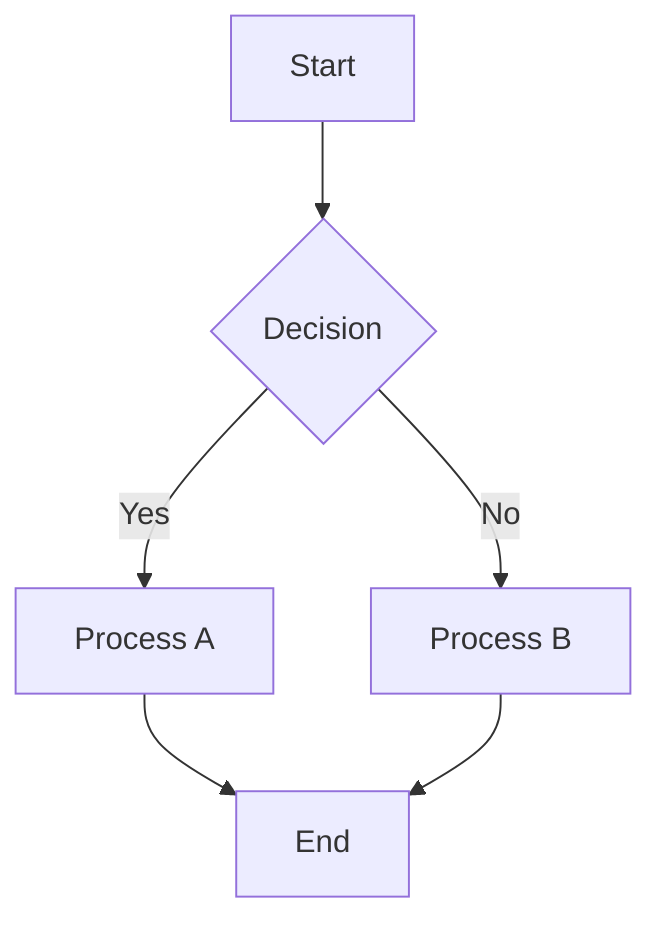

**Syntax:**

- Direction: `TB` (top-bottom), `LR` (left-right), `BT`, `RL`
- Node shapes: `[]` rectangle, `{}` diamond, `()` circle, `[[]]` stadium
- Arrows: `-->` solid, `-.->` dashed, `==>` thick

### Sequence Diagrams

Use for showing interactions between actors/components.

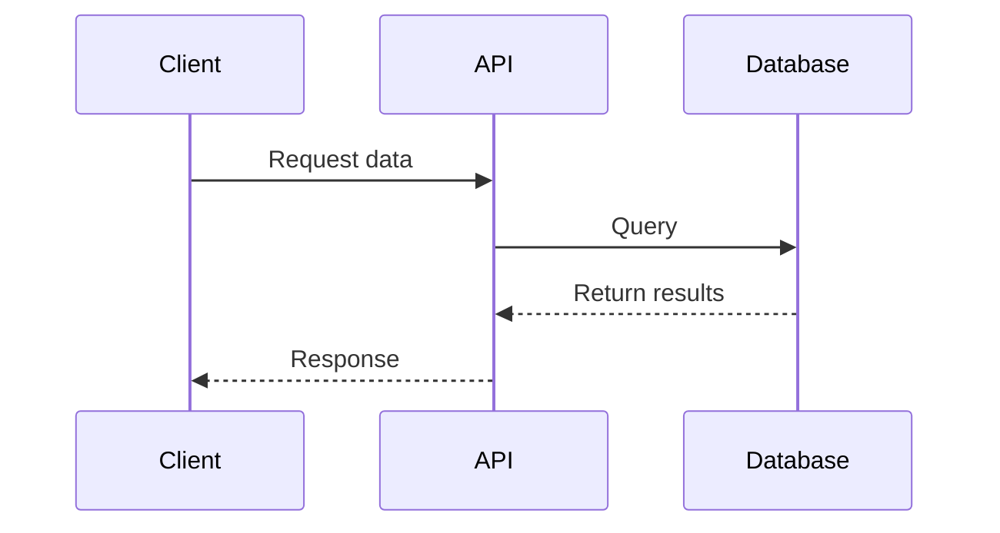

**Syntax:**

- Participants: `participant Name`
- Messages: `->>` solid, `-->>` dashed/open
- Activations: `activate`/`deactivate`
- Notes: `Note over/left/right of`

### Class Diagrams

Use for object-oriented design documentation.

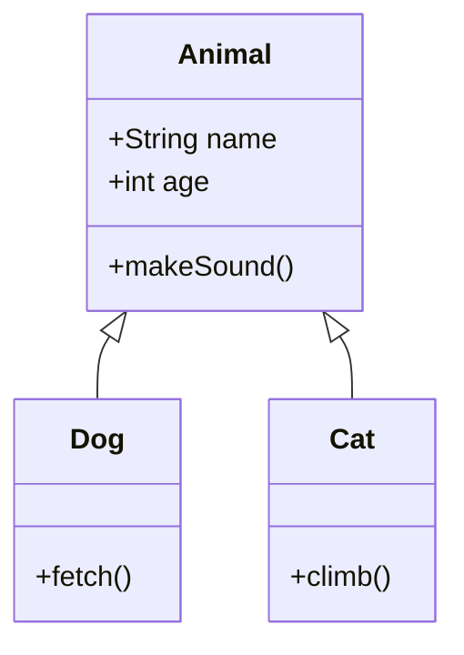

**Syntax:**

- Visibility: `+` public, `-` private, `#` protected
- Relationships: `<|--` inheritance, `*--` composition, `o--` aggregation
- Methods: `methodName()` with types

### ER Diagrams

Use for database schema documentation.

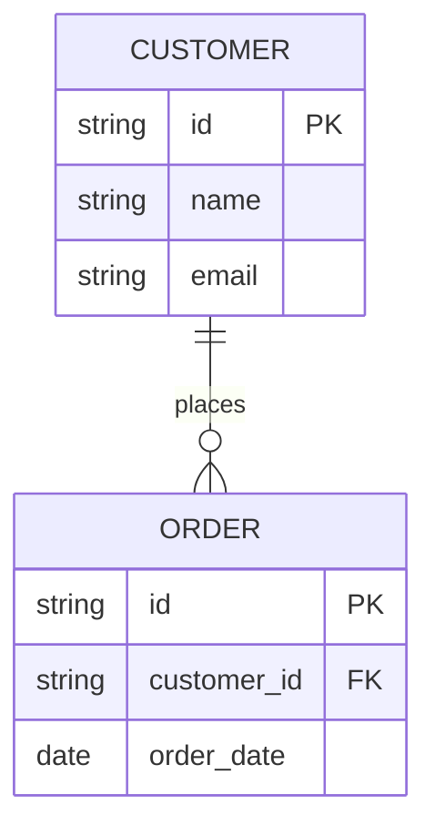

**Syntax:**

- Relationships: `||--o{` (one-to-many), `||--||` (one-to-one)
- Keys: `PK` primary key, `FK` foreign key
- Types: string, int, date, etc.

### Gantt Charts

Use for project timelines and milestones.

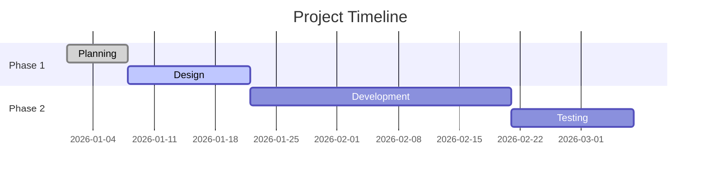

**Syntax:**

- Status: `:done`, `:active`, `:crit` (critical)
- Dependencies: `after task_name`
- Sections: `section Name`

## Syntax Standards

### Indentation

- Use 4 spaces for nesting
- Align related elements
- Group related nodes

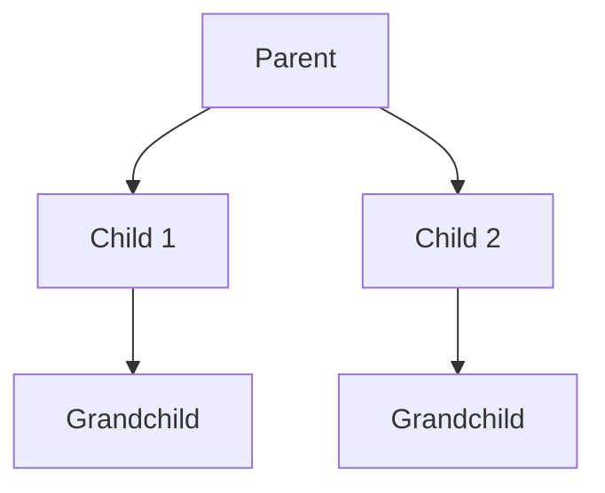

### Node Naming

- Use descriptive names: `authService` not `A1`
- CamelCase for multi-word: `userDatabase`
- Add labels for clarity: `authService[Authentication Service]`
- Avoid spaces in IDs: use hyphens or camelCase

### Comments

Use `%%` for single-line comments:

```mermaid
%% This is a comment
flowchart TD
    A[Start] --> B[End] %% inline comment
```

## Styling Guidelines

### Subgraphs

Group related elements using subgraphs:

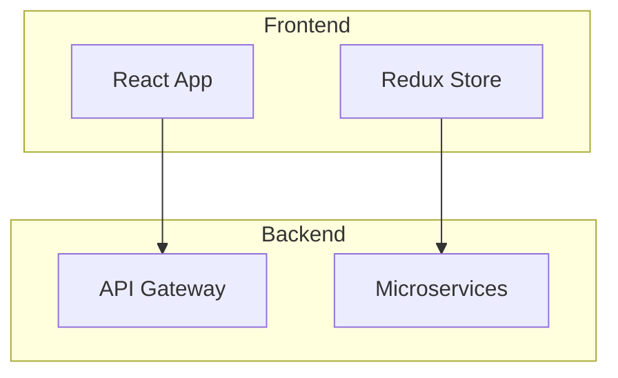

### Styling Nodes

Use classes for consistent styling:

```mermaid
flowchart TD
    A[Start]:::start
    B[Process]
    C[End]:::end

    classDef start fill:#90EE90,stroke:#333
    classDef end fill:#FFB6C1,stroke:#333
```

### Colors

- Use semantic colors: green (start/success), red (error), yellow (warning)
- Ensure contrast ratios meet WCAG 2.1 standards
- Avoid color as the only means of conveying information

## Documentation Integration

### Embedding in Markdown

```markdown
## Architecture

The system follows a microservices pattern:

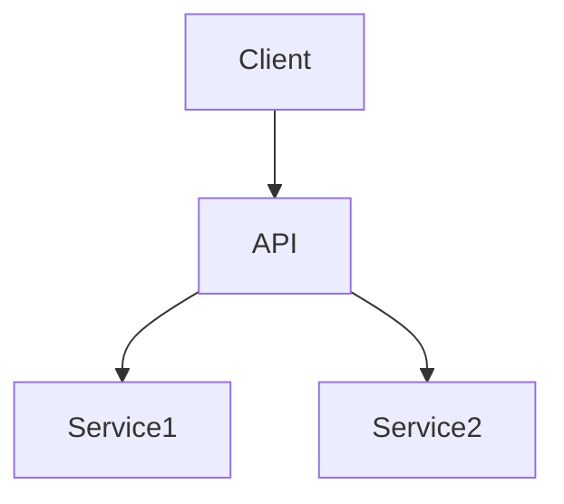

```

### Using Diagram References

```markdown
See the [deployment diagram](#deployment-diagram) for infrastructure details.

<a name="deployment-diagram"></a>
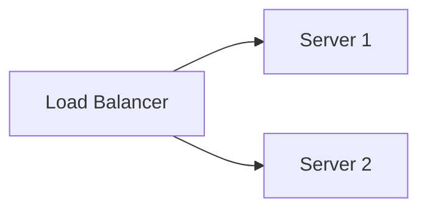

```

## Accessibility

### Alt Text
Always provide descriptive alt text:

```markdown

```

### Color Independence

- Use patterns or labels in addition to colors
- Provide text descriptions for complex diagrams
- Test with grayscale filters

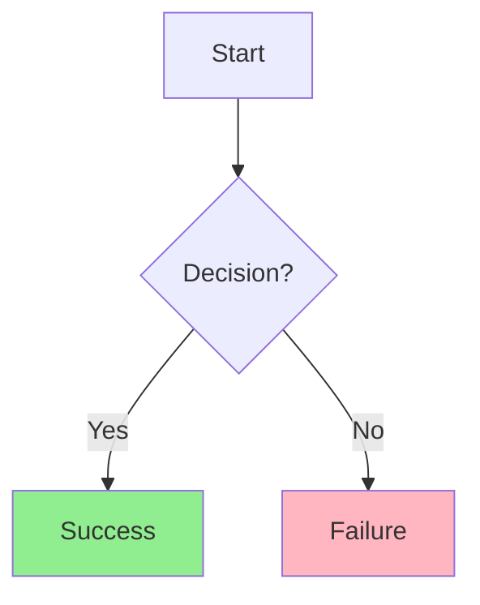

## Version Control Best Practices

1. **Line breaks**: Put each node/connection on separate lines
2. **Comments**: Add comments explaining complex logic
3. **Versions**: Note Mermaid version compatibility
4. **Review**: Review diagram changes in PRs
5. **Testing**: Verify diagrams render correctly

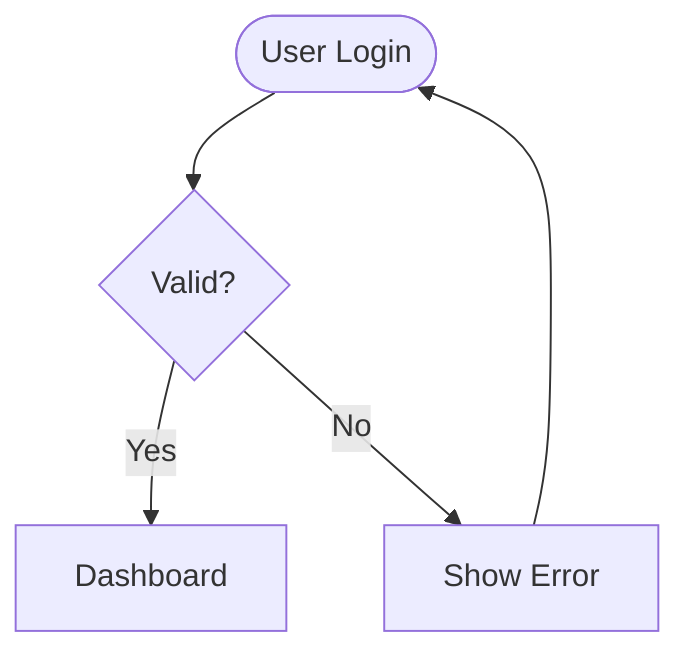

## Common Patterns

### Decision Tree

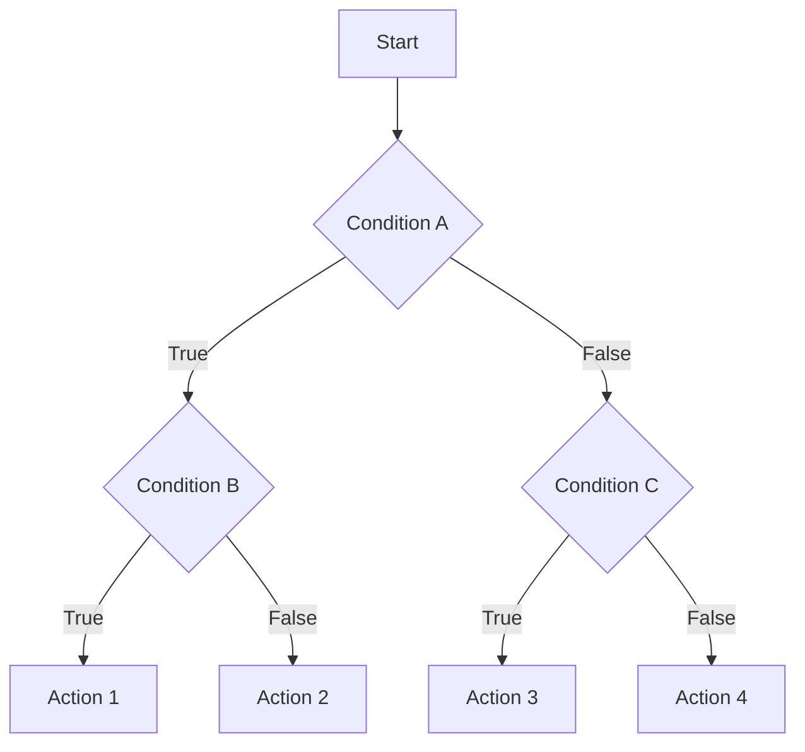

### Request Flow

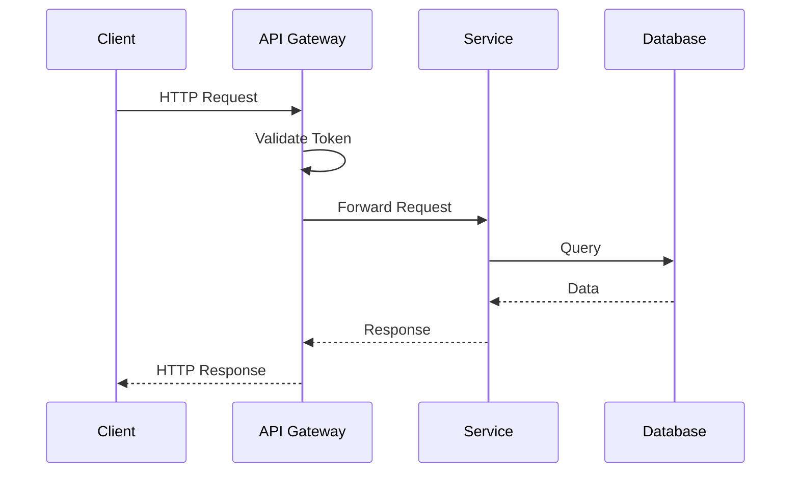

### Module Dependencies

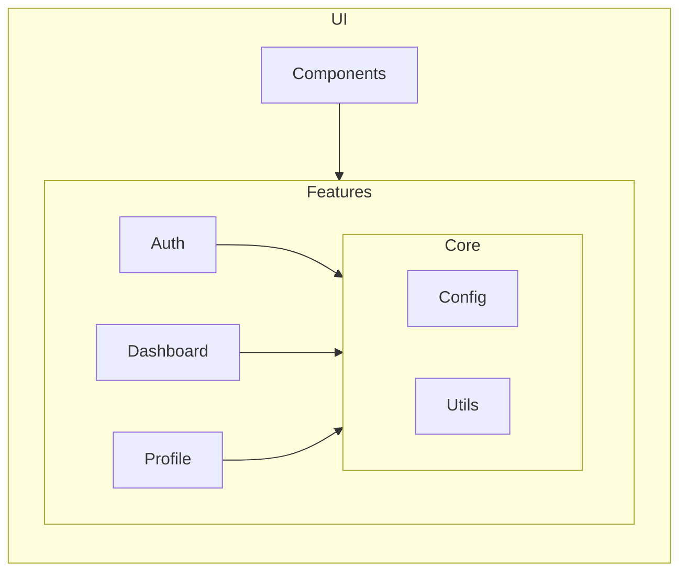

## Best Practices

1. Keep diagrams focused on one concept
2. Use consistent naming conventions
3. Limit diagram complexity (break into multiple if needed)
4. Add legends for complex color schemes
5. Test rendering in target platform (GitHub, docs, etc.)
6. Use subgraphs to organize related elements
7. Include direction indicators for clarity
8. Document diagram purpose in comments
9. Review for accuracy when code changes
10. Prefer clarity over completeness

**BE CONSISTENT.** When creating diagrams, follow established patterns in the project.

*References:*

- [Mermaid Documentation](https://mermaid.js.org/)
- [Mermaid Live Editor](https://mermaid.live/)
- [GitHub Mermaid Support](https://github.blog/developer-skills/github/include-diagrams-markdown-files-mermaid/)
